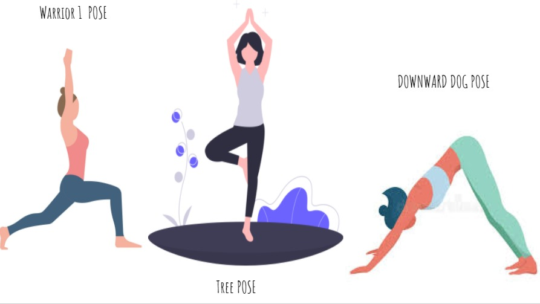
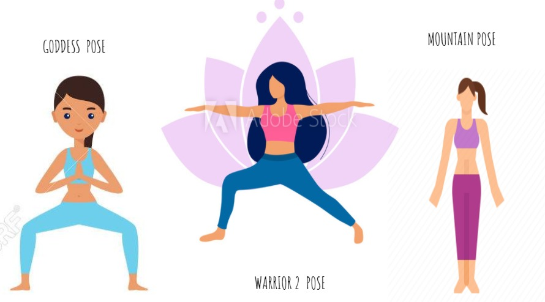

# Exercise-And-Yoga-Tracker

<b><a href="https://elysian01.github.io/Exercise-And-Yoga-Tracker/">Click here</a> to visit website</b>

### With the need to be fit and healthy on the rise today, Yoga-Tracker proves to be a valuable solution. 

* Yoga-Tracker classifies various Yoga poses and not just static pictures but also real time yoga poses performed in front of the camera. 

* It tracks how long you hold a yoga pose and keeps a track record which motivates you in your journey.

* It educates users of various poses and it's benefits along with proper guidance on how to perform them.

* It boasts of comaptibility over all devices, Web, Android and IOS.

## Get Started

<b>It is recommended to open website (index.html) in local machine using live server of vscode or any other Apache server, for fast loading of tensorflowjs model</b>

## Classification

It can classify 6 different yoga poses which are divided into 2 sets

* Yoga Set 1
    1. Tree Pose
    2. Warrior1 Pose
    3. Downward Dog Pose
  

* Yoga Set 2
    1. Mountain Pose
    2. Warrior2 Pose
    3. Godess Pose
  
